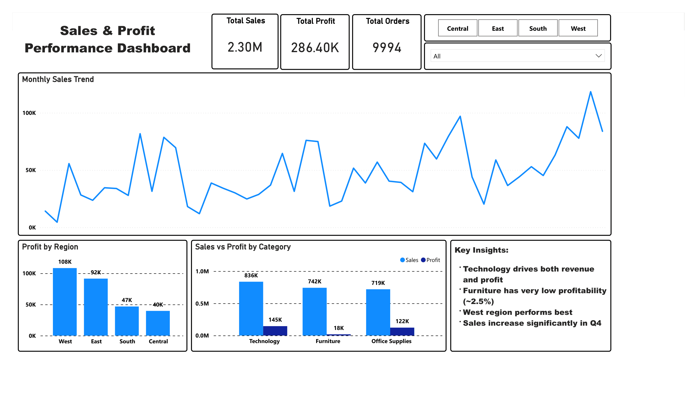

# Sales & Profit Performance Analysis

## 📌 Business Problem

This project analyzes sales and profitability performance to identify key business drivers, underperforming areas, and opportunities for improvement. The goal is to support data-driven decision-making by highlighting where the business generates value and where profitability can be improved.

---

## 📊 Dataset

* Source: Superstore Sales Dataset
* Total Orders: 9,994
* Tools Used: Excel, Power BI

---

## 🎯 Key Business Questions

* Which category generates the most revenue?
* Which category is the most profitable?
* Are there categories with high sales but low profit?
* Which region performs best?
* How do sales trends change over time?

---

## 📈 Key Metrics

* **Total Sales:** 2.30M
* **Total Profit:** 286.40K
* **Total Orders:** 9,994

---

## 🔍 Key Insights

1. **Technology drives overall performance**
   Technology generates both the highest sales and profit, making it the strongest-performing category.

2. **Furniture has poor profitability**
   Despite relatively strong sales, Furniture has a very low profit margin (~2.5%), indicating potential inefficiencies or heavy discounting.

3. **Office Supplies shows stable performance**
   Office Supplies maintains consistent sales with strong profit margins (~17%), making it a reliable contributor.

4. **West region leads in profit**
   The West region contributes the highest profit, suggesting stronger market or operational performance.

5. **Sales increase toward year-end (Q4)**
   Sales trends show consistent growth toward the end of the year, indicating seasonality and higher demand in Q4.

---

## 💡 Business Recommendations

* Improve profitability in Furniture by reviewing pricing, discount strategies, and cost structure.
* Invest more in Technology products to maximize high-margin opportunities.
* Replicate successful strategies from the West region in other regions.
* Prepare inventory and marketing strategies ahead of Q4 to capitalize on seasonal demand.

---

## 📊 Dashboard Preview

